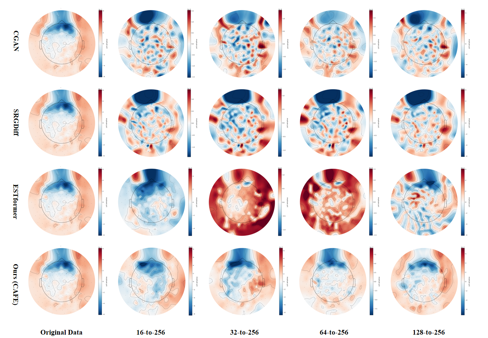
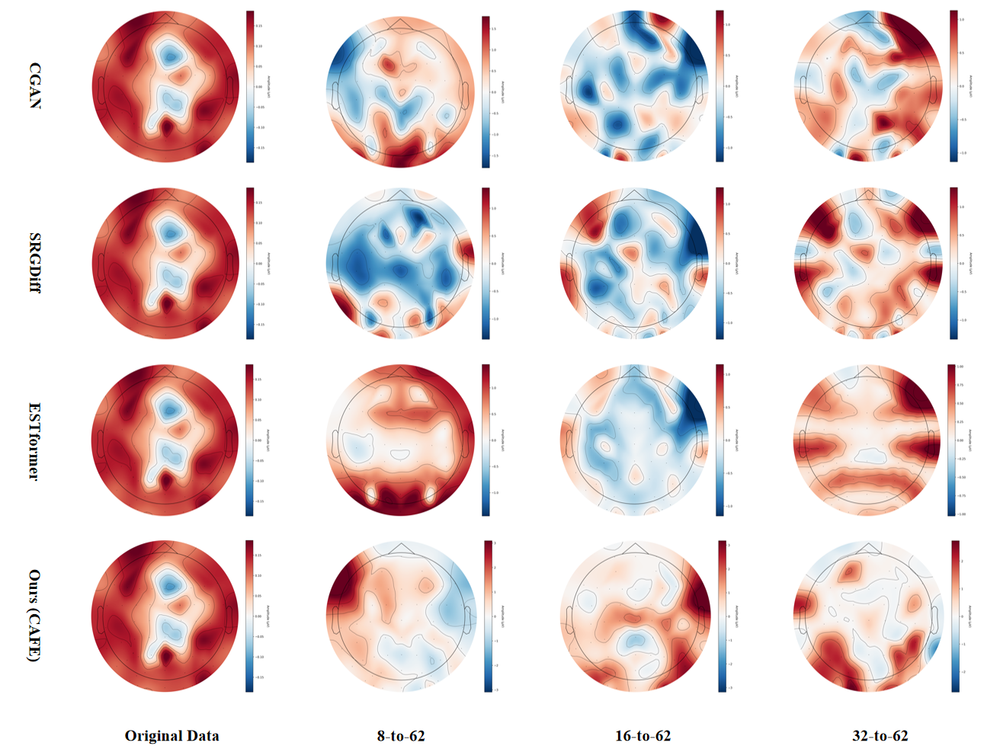

# CAFE: Channel-Autoregressive Factorized Encoding for Robust Biosignal Spatial Super-Resolution

<p align="center">





</p>

**Figure 1: Comparative Analysis of EEG Topographic Maps**

**Left**: EEG topographic map comparison on the MI dataset, showcasing reconstructed data from our method (cafe) against other models.

**Right**: EEG topographic map comparison on the SEED dataset, illustrating reconstructed data from our method (cafe) versus alternative models.
​

## :wrench: Dependencies and Installation

### System Requirements
- Python >= 3.8 (Tested with Python 3.11.7)
- PyTorch >= 1.10 (Tested with PyTorch 2.1.2+cu118)
- CUDA >= 11.8 (Recommended for GPU acceleration)
- Linux (Recommended)

### Installation
1. Clone repository:
   ```bash
   git clone https://github.com/yourusername/yourproject.git
   cd yourproject
   ```

2. Create and activate conda environment:
   ```bash
   conda create -n eegsr python=3.11.7
   conda activate eegsr
   ```

3. Install dependencies:
   ```bash
   pip install -r requirements.txt
   ```

## :computer: Training

### Dataset Preparation
Download datasets:
   - SEED: http://bcmi.sjtu.edu.cn/~seed
   - CPSC2018: https://hf-mirror.com/datasets/kushalps/cpsc2018
   - Localize-MI: https://doi.org/10.12751/g-node.1cc1a
   - sEMG: https://fb-ctrl-oss.s3.amazonaws.com/generic-neuromotor-interface-data
   - AJILE12: https://dandiarchive.org/dandiset/000055/0.220127.0436

### Start Training and Testing

After completing the environment setup and data preparation, you can directly start the entire training and evaluation pipeline by running the following command:

```bash

python train_test_new.py

```
